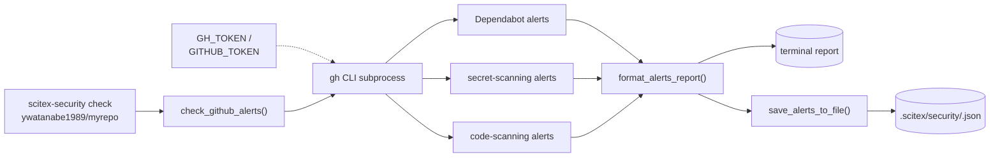

# scitex-security

<p align="center">
  <a href="https://scitex.ai">
    
  </a>
</p>

<p align="center"><b>GitHub security-alert utilities — Dependabot, secret scanning, code scanning. Pure stdlib + `gh` subprocess, zero scitex.* runtime deps.</b></p>

<p align="center">
  <a href="https://scitex-security.readthedocs.io/">Full Documentation</a> · <code>uv pip install scitex-security[all]</code>
</p>

<!-- scitex-badges:start -->
<p align="center">
  <a href="https://pypi.org/project/scitex-security/"></a>
  <a href="https://pypi.org/project/scitex-security/"></a>
  <a href="https://github.com/ywatanabe1989/scitex-security/actions/workflows/test.yml"></a>
  <a href="https://github.com/ywatanabe1989/scitex-security/actions/workflows/install-test.yml"></a>
  <a href="https://codecov.io/gh/ywatanabe1989/scitex-security"></a>
  <a href="https://scitex-security.readthedocs.io/en/latest/"></a>
  <a href="https://www.gnu.org/licenses/agpl-3.0"></a>
</p>
<!-- scitex-badges:end -->

---

## Installation

```bash
pip install scitex-security
```

## Architecture

```
src/scitex_security/
├── __init__.py     # public re-exports
├── github.py       # GitHub alert collection (Dependabot / secret / code scanning)
├── cli.py          # `scitex-security check` / `show-latest`
├── __main__.py     # python -m scitex_security
└── _skills.py      # bundled agent skills

Runtime flow:
  scitex-security check <owner/repo>
        │
        ▼
  github.check_github_alerts()
        │ subprocess
        ▼
  gh api repos/<owner>/<repo>/{dependabot,secret-scanning,code-scanning}/alerts
        │
        ▼
  format_alerts_report() → save_alerts_to_file(.scitex/security/)
```

`scitex-security` shells out to `gh` (GitHub CLI) and never touches
your tokens directly — `GH_TOKEN` / `GITHUB_TOKEN` are read by the
`gh` subprocess from the environment, not from this package.

## 2 Interfaces

<details open>
<summary><strong>Python API (primary)</strong></summary>

<br>

```python
from scitex_security import (
    check_github_alerts,
    save_alerts_to_file,
    format_alerts_report,
    GitHubSecurityError,
)

alerts = check_github_alerts(repo="ywatanabe1989/myrepo")
print(format_alerts_report(alerts))
save_alerts_to_file(alerts, output_dir=".scitex/security")
```

</details>

<details>
<summary><strong>CLI</strong></summary>

<br>

```bash
scitex-security check ywatanabe1989/myrepo
scitex-security show-latest --security-dir ./logs/security
```

</details>

## Demo



## Quick Start

See the Python API block above for the minimal end-to-end example.

## Environment Variables

| Variable | Purpose | Default |
|----------|---------|---------|
| `SCITEX_SECURITY_CONFIG` | Path to a YAML config file (overrides `~/.scitex/security/config.yaml`). | unset |
| `GH_TOKEN` / `GITHUB_TOKEN` | Auth token used by the underlying `gh` CLI subprocess. | unset |

Config precedence: explicit path → `$SCITEX_SECURITY_CONFIG` → `~/.scitex/security/config.yaml` → built-in defaults.

## Status

Standalone fork of `scitex.security`. Pure stdlib + `gh` CLI subprocess —
zero scitex.* runtime deps. Umbrella `scitex.security` import path is
preserved via a `sys.modules`-alias bridge.

## Part of SciTeX

`scitex-security` is part of [**SciTeX**](https://scitex.ai). Install via
the umbrella with `pip install scitex[security]` to use as
`scitex.security` (Python) or `scitex security ...` (CLI).

>Four Freedoms for Research
>
>0. The freedom to **run** your research anywhere — your machine, your terms.
>1. The freedom to **study** how every step works — from raw data to final manuscript.
>2. The freedom to **redistribute** your workflows, not just your papers.
>3. The freedom to **modify** any module and share improvements with the community.
>
>AGPL-3.0 — because we believe research infrastructure deserves the same freedoms as the software it runs on.

## License

AGPL-3.0-only (see [LICENSE](./LICENSE)).

---

<p align="center">
  <a href="https://scitex.ai" target="_blank"></a>
</p>
